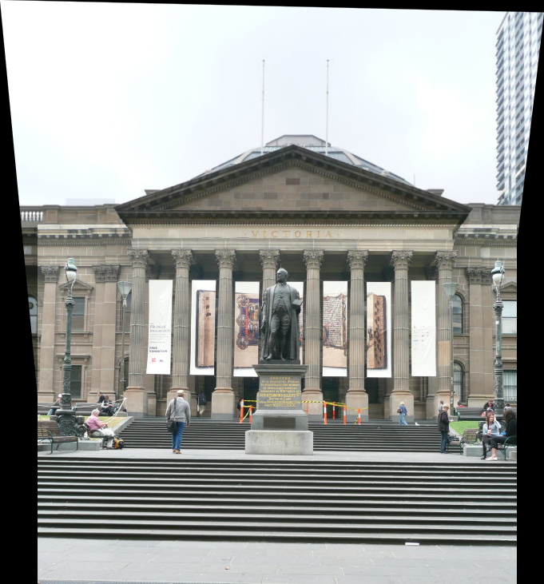
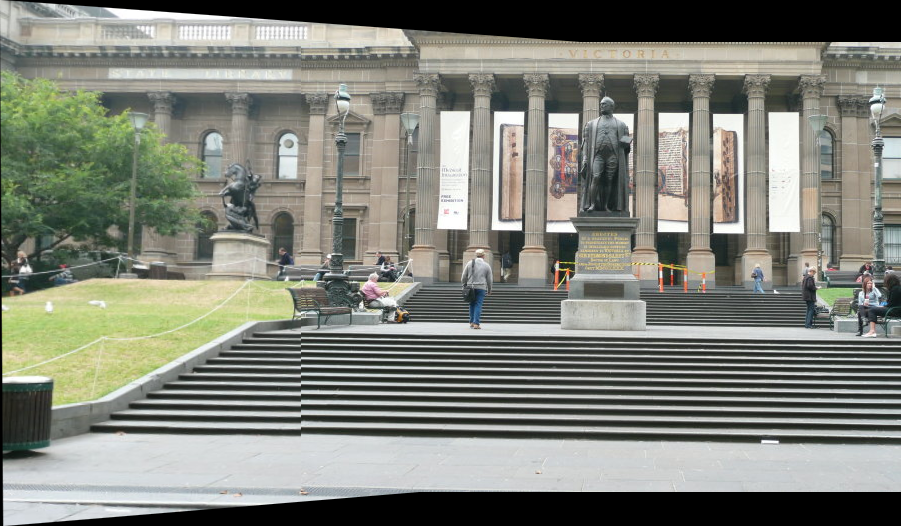
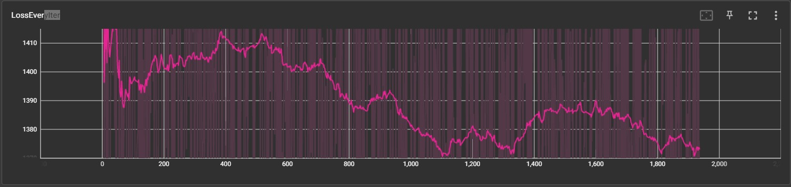
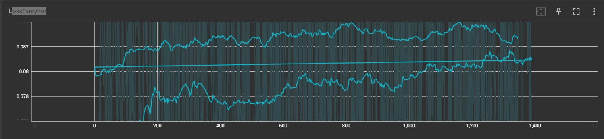

# Panorama Stitching

## Outputs

### Classical Panorama Stitching Output

| Output 1 | Output 2 |
|----------|----------|
|  |  |


### Supervised and Self-Supervised Output

| Supervised Homography Net Loss | Self-supervised Homography Net Loss |
|--------------------------------|-------------------------------------|
|  |  |

## Table of Contents
- [About The Project](#about-the-project)
- [Repository Structure](#repository-structure)
- [Technologies](#technologies)
- [Installation & Usage](#installation--usage)
- [Contributing](#contributing)


## About The Project
In Phase 1, the project utilizes traditional computer vision methods for stitching together multiple images. This includes Harris Corner Detection, Feature Descriptors, Feature Matching, the RANSAC algorithm, and warping and blending of images.

Phase 2 employs deep learning techniques for panorama stitching. This includes a Homography Net used for supervised learning, and Tensor Direct Linear Transform (DLT) for self-supervised learning.

## Repository Structure

```markdown
.
├── Phase1
│   ├── Outputs
│   │   ├── mypano1.png
│   │   ├── mypano2.png
│   ├── code
│   │   ├── main.py
│   │   ├── utils.py
├── Phase2
│   ├── deep_output
│   │   ├── supervisedlos.jpeg
│   │   ├── unsupervisedlos.jpg
│   ├── code
│   │   ├── main.py
│   │   ├── utils.py
└── README.md

```

## Repository Structure
The repository is structured as follows:
- `/Code`: This Folder consist the Wrapper.py code for camera calibration.
- `/Calibration_Imgs/Outputs/`: Consist of the Acutal and Reprojected corner images.


## Technologies

This project leverages several significant technologies:

- **OpenCV**: A robust library in the computer vision field, utilized here for image processing tasks along with its in-built camera calibration and distortion correction functionalities.

- **NumPy**: An essential Python library for handling high-performance computations on multi-dimensional arrays and matrices, a common requirement in computer vision.

- **Zhang's Method**: The cornerstone of this project, providing an effective and efficient approach to camera calibration by observing a planar pattern from multiple orientations.

- **Optimization Techniques**: Employed within the calibration process to determine the best fit camera parameters, minimizing the discrepancy between observed and projected image points.

- **Distortion Models**: Radial and tangential models are applied for accurate image reconstruction and considered during the calibration process.

- **Matplotlib**: Deployed for visualization of calibration results, offering a clear graphical representation of images with overlaid calibration patterns.


## Installation & Usage
To run the project locally, follow these steps:

1. Clone the repository:

```shell
git clone https://github.com/Prasannanatu/Zhang-s-Camera-Calibration.git
 ```
 
Install the required dependencies. You can use the provided requirements.txt file to install the necessary packages. Run the following command:


```bash
pip install opencv-python numpy matplotlib scipy
 ```
 
 

 
Run the project using the provided scripts or commands. Refer to the documentation or project files for specific instructions on running the Calibration algorithms.

 ```bash
python3 Wrapper.py
 ```

## References

The following sources have been instrumental in the development of this project:

1. Z. Zhang. "A Flexible New Technique for Camera Calibration". IEEE Transactions on Pattern Analysis and Machine Intelligence. 2000. [[link]](https://www.microsoft.com/en-us/research/wp-content/uploads/2016/02/tr98-71.pdf)

2.RBE-549 Computer Vision course project page[[link]](https://rbe549.github.io/spring2023/hw/hw1/).


## Tags
-  Camera-Calibration
- Comupter Vision
- 3D-Reconstruction
- Zhang's-Method
- Optimization
- Distortion-Correction,


<!-- -Classical Panorama Stitching Output:
|  |  |
|:--:|:---:|
| output_1 | output_2|


-Supervised and Self-Supervised Output:
|  |  |
|:--:|:---:|
| Suervised Homography Net loss | Self-suervised Homography Net loss| -->


